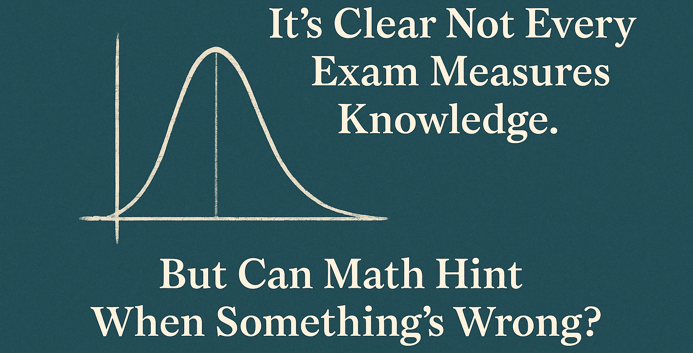

This article was written just for the fun of it, to share a simple yet interesting application of mathematics. It uses a bit of probability theory to reflect on exams and how sometimes it’s not the students who fail, but the tests themselves.
